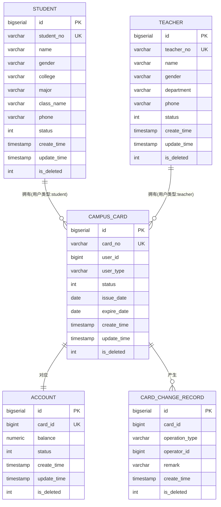
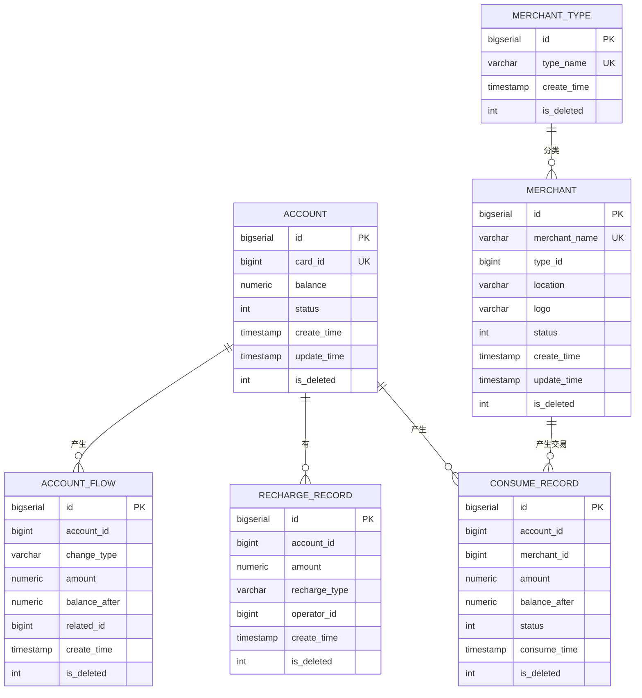
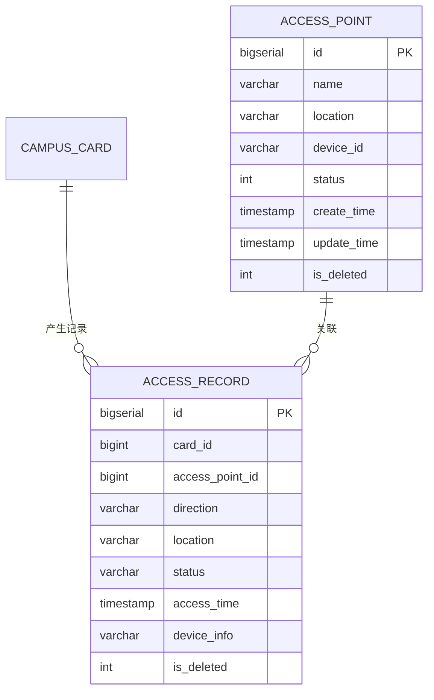
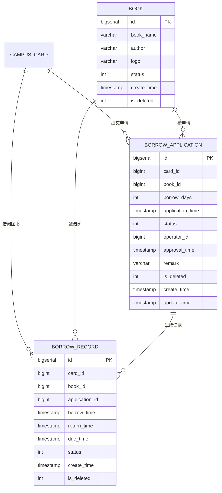
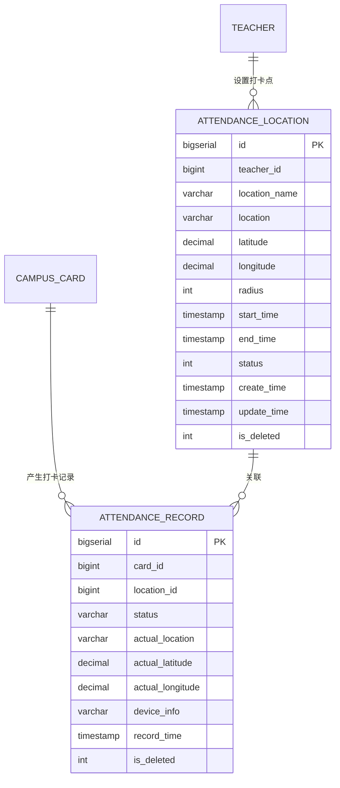
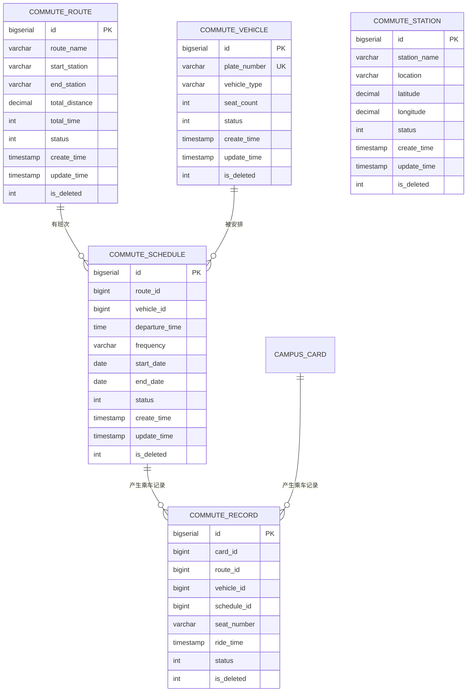
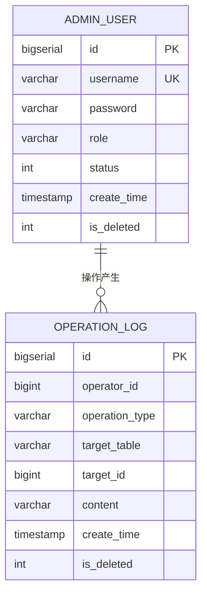

# 校园一卡通系统 - ER图

> 基于 OpenGauss 数据库设计的完整实体关系图

---

## 目录
1. [系统概述](#1-系统概述)
2. [核心业务模块ER图](#2-核心业务模块er图)
3. [辅助业务模块ER图](#3-辅助业务模块er图)
4. [系统管理模块ER图](#4-系统管理模块er图)
5. [完整ER图](#5-完整er图)
6. [实体关系说明](#6-实体关系说明)

---

## 1. 系统概述

本校园一卡通系统是一个综合性的智慧校园管理平台,涵盖以下核心功能模块:

### 系统架构
```
┌─────────────────────────────────────────────────────────────┐
│                      校园一卡通系统                          │
├─────────────────────────────────────────────────────────────┤
│  ┌──────────┐  ┌──────────┐  ┌──────────┐  ┌──────────┐   │
│  │ 用户管理 │  │ 校园卡   │  │ 账户管理 │  │ 充值消费 │   │
│  └──────────┘  └──────────┘  └──────────┘  └──────────┘   │
│  ┌──────────┐  ┌──────────┐  ┌──────────┐  ┌──────────┐   │
│  │ 商户管理 │  │ 门禁管理 │  │ 图书借阅 │  │ 考勤管理 │   │
│  └──────────┘  └──────────┘  └──────────┘  └──────────┘   │
│  ┌──────────┐  ┌──────────┐                              │
│  │ 通勤车   │  │ 系统管理 │                              │
│  └──────────┘  └──────────┘                              │
└─────────────────────────────────────────────────────────────┘
```

### 设计特点
- ✅ 使用逻辑外键,不使用物理外键约束
- ✅ 所有表统一使用软删除机制 (`is_deleted`)
- ✅ 统一的时间戳字段 (`create_time`, `update_time`)
- ✅ 完整的操作日志记录

---

## 2. 核心业务模块ER图

### 2.1 用户与校园卡关系



### 2.2 账户与交易关系



---

## 3. 辅助业务模块ER图

### 3.1 门禁管理模块



### 3.2 图书借阅模块



### 3.3 考勤管理模块



### 3.4 通勤车管理模块



---

## 4. 系统管理模块ER图



---

## 5. 完整ER图

### 5.1 系统总览ER图

```mermaid
erDiagram
    %% 用户模块
    STUDENT ||--o{ CAMPUS_CARD : "拥有(student)"
    TEACHER ||--o{ CAMPUS_CARD : "拥有(teacher)"
    ADMIN_USER ||--o{ OPERATION_LOG : "产生"
    
    %% 校园卡模块
    CAMPUS_CARD ||--|| ACCOUNT : "对应"
    CAMPUS_CARD ||--o{ CARD_CHANGE_RECORD : "产生"
    CAMPUS_CARD ||--o{ ACCESS_RECORD : "通行"
    CAMPUS_CARD ||--o{ BORROW_APPLICATION : "申请借阅"
    CAMPUS_CARD ||--o{ BORROW_RECORD : "借阅"
    CAMPUS_CARD ||--o{ ATTENDANCE_RECORD : "打卡"
    CAMPUS_CARD ||--o{ COMMUTE_RECORD : "乘车"
    
    %% 账户模块
    ACCOUNT ||--o{ ACCOUNT_FLOW : "流水"
    ACCOUNT ||--o{ RECHARGE_RECORD : "充值"
    ACCOUNT ||--o{ CONSUME_RECORD : "消费"
    
    %% 商户模块
    MERCHANT_TYPE ||--o{ MERCHANT : "分类"
    MERCHANT ||--o{ CONSUME_RECORD : "产生消费"
    
    %% 门禁模块
    ACCESS_POINT ||--o{ ACCESS_RECORD : "关联"
    
    %% 图书模块
    BOOK ||--o{ BORROW_APPLICATION : "被申请"
    BOOK ||--o{ BORROW_RECORD : "被借阅"
    BORROW_APPLICATION ||--o{ BORROW_RECORD : "生成"
    
    %% 考勤模块
    TEACHER ||--o{ ATTENDANCE_LOCATION : "设置"
    ATTENDANCE_LOCATION ||--o{ ATTENDANCE_RECORD : "关联"
    
    %% 通勤车模块
    COMMUTE_ROUTE ||--o{ COMMUTE_SCHEDULE : "有班次"
    COMMUTE_VEHICLE ||--o{ COMMUTE_SCHEDULE : "被安排"
    COMMUTE_SCHEDULE ||--o{ COMMUTE_RECORD : "产生记录"
    
    STUDENT {
        bigserial id PK
        varchar student_no UK
        varchar name
        varchar gender
        varchar college
        varchar major
        varchar class_name
        varchar phone
        int status
        timestamp create_time
        timestamp update_time
        int is_deleted
    }
    
    TEACHER {
        bigserial id PK
        varchar teacher_no UK
        varchar name
        varchar gender
        varchar department
        varchar phone
        int status
        timestamp create_time
        timestamp update_time
        int is_deleted
    }
    
    ADMIN_USER {
        bigserial id PK
        varchar username UK
        varchar password
        varchar role
        int status
        timestamp create_time
        int is_deleted
    }
    
    CAMPUS_CARD {
        bigserial id PK
        varchar card_no UK
        bigint user_id
        varchar user_type
        int status
        date issue_date
        date expire_date
        timestamp create_time
        timestamp update_time
        int is_deleted
    }
    
    CARD_CHANGE_RECORD {
        bigserial id PK
        bigint card_id
        varchar operation_type
        bigint operator_id
        varchar remark
        timestamp create_time
        int is_deleted
    }
    
    ACCOUNT {
        bigserial id PK
        bigint card_id UK
        numeric balance
        int status
        timestamp create_time
        timestamp update_time
        int is_deleted
    }
    
    ACCOUNT_FLOW {
        bigserial id PK
        bigint account_id
        varchar change_type
        numeric amount
        numeric balance_after
        bigint related_id
        timestamp create_time
        int is_deleted
    }
    
    RECHARGE_RECORD {
        bigserial id PK
        bigint account_id
        numeric amount
        varchar recharge_type
        bigint operator_id
        timestamp create_time
        int is_deleted
    }
    
    CONSUME_RECORD {
        bigserial id PK
        bigint account_id
        bigint merchant_id
        numeric amount
        numeric balance_after
        int status
        timestamp consume_time
        int is_deleted
    }
    
    MERCHANT_TYPE {
        bigserial id PK
        varchar type_name UK
        timestamp create_time
        int is_deleted
    }
    
    MERCHANT {
        bigserial id PK
        varchar merchant_name UK
        bigint type_id
        varchar location
        varchar logo
        int status
        timestamp create_time
        timestamp update_time
        int is_deleted
    }
    
    ACCESS_POINT {
        bigserial id PK
        varchar name
        varchar location
        varchar device_id
        int status
        timestamp create_time
        timestamp update_time
        int is_deleted
    }
    
    ACCESS_RECORD {
        bigserial id PK
        bigint card_id
        bigint access_point_id
        varchar direction
        varchar location
        varchar status
        timestamp access_time
        varchar device_info
        int is_deleted
    }
    
    BOOK {
        bigserial id PK
        varchar book_name
        varchar author
        varchar logo
        int status
        timestamp create_time
        int is_deleted
    }
    
    BORROW_APPLICATION {
        bigserial id PK
        bigint card_id
        bigint book_id
        int borrow_days
        timestamp application_time
        int status
        bigint operator_id
        timestamp approval_time
        varchar remark
        int is_deleted
        timestamp create_time
        timestamp update_time
    }
    
    BORROW_RECORD {
        bigserial id PK
        bigint card_id
        bigint book_id
        bigint application_id
        timestamp borrow_time
        timestamp return_time
        timestamp due_time
        int status
        timestamp create_time
        int is_deleted
    }
    
    ATTENDANCE_LOCATION {
        bigserial id PK
        bigint teacher_id
        varchar location_name
        varchar location
        decimal latitude
        decimal longitude
        int radius
        timestamp start_time
        timestamp end_time
        int status
        timestamp create_time
        timestamp update_time
        int is_deleted
    }
    
    ATTENDANCE_RECORD {
        bigserial id PK
        bigint card_id
        bigint location_id
        varchar status
        varchar actual_location
        decimal actual_latitude
        decimal actual_longitude
        varchar device_info
        timestamp record_time
        int is_deleted
    }
    
    COMMUTE_ROUTE {
        bigserial id PK
        varchar route_name
        varchar start_station
        varchar end_station
        decimal total_distance
        int total_time
        int status
        timestamp create_time
        timestamp update_time
        int is_deleted
    }
    
    COMMUTE_VEHICLE {
        bigserial id PK
        varchar plate_number UK
        varchar vehicle_type
        int seat_count
        int status
        timestamp create_time
        timestamp update_time
        int is_deleted
    }
    
    COMMUTE_STATION {
        bigserial id PK
        varchar station_name
        varchar location
        decimal latitude
        decimal longitude
        int status
        timestamp create_time
        timestamp update_time
        int is_deleted
    }
    
    COMMUTE_SCHEDULE {
        bigserial id PK
        bigint route_id
        bigint vehicle_id
        time departure_time
        varchar frequency
        date start_date
        date end_date
        int status
        timestamp create_time
        timestamp update_time
        int is_deleted
    }
    
    COMMUTE_RECORD {
        bigserial id PK
        bigint card_id
        bigint route_id
        bigint vehicle_id
        bigint schedule_id
        varchar seat_number
        timestamp ride_time
        int status
        int is_deleted
    }
    
    OPERATION_LOG {
        bigserial id PK
        bigint operator_id
        varchar operation_type
        varchar target_table
        bigint target_id
        varchar content
        timestamp create_time
        int is_deleted
    }
```



---

## 6. 实体关系说明

### 6.1 关系类型说明

| 关系符号 | 含义 | 说明 |
|---------|------|------|
| `||--||` | 一对一 | 一个实体对应另一个实体 |
| `||--o{` | 一对多 | 一个实体对应多个实体 |
| `}o--o{` | 多对多 | 多个实体对应多个实体 |

### 6.2 核心关系详解

#### 1. 用户与校园卡关系
- **学生 → 校园卡**: 一对多,一个学生可以有一张校园卡
- **教师 → 校园卡**: 一对多,一个教师可以有一张校园卡
- **校园卡 → 账户**: 一对一,每张卡对应一个账户
- **校园卡 → 卡操作记录**: 一对多,一张卡可以有多次操作记录

#### 2. 账户与交易关系
- **账户 → 账户流水**: 一对多,一个账户有多条流水记录
- **账户 → 充值记录**: 一对多,一个账户有多条充值记录
- **账户 → 消费记录**: 一对多,一个账户有多条消费记录
- **商户类型 → 商户**: 一对多,一种类型对应多个商户
- **商户 → 消费记录**: 一对多,一个商户有多笔消费记录

#### 3. 辅助业务关系
- **校园卡 → 门禁记录**: 一对多,记录每次门禁通行
- **校园卡 → 借阅申请/借阅记录**: 一对多,记录图书借阅情况
- **校园卡 → 考勤记录**: 一对多,记录每次考勤打卡
- **校园卡 → 通勤车记录**: 一对多,记录每次乘车

### 6.3 关键字段说明

#### 软删除机制
所有表都包含 `is_deleted` 字段:
- `0`: 未删除(正常状态)
- `1`: 已删除(软删除状态)

#### 状态字段
- **校园卡状态**: `0=注销`, `1=正常`, `2=挂失`
- **用户状态**: `1=正常`
- **图书状态**: `1=可借阅`, `2=已借出`
- **借阅记录状态**: `1=借阅中`, `2=已归还`, `3=超期`

#### 时间字段
- `create_time`: 记录创建时间
- `update_time`: 记录更新时间

### 6.4 索引设计要点

系统已为以下关键字段创建索引以提升查询性能:

1. **校园卡相关**: `card_no`, `user_id`, `status`
2. **账户相关**: `card_id`, `status`
3. **交易记录**: `account_id`, `create_time`, `merchant_id`
4. **用户相关**: `student_no`, `teacher_no`
5. **辅助模块**: 各类记录的 `card_id`, `time` 字段

---

## 7. 数据流转示例

### 开卡流程
```
新增学生/教师 → 创建校园卡 → 创建账户 → 记录开卡操作
```

### 消费流程
```
校园卡消费 → 验证余额 → 扣减余额 → 创建消费记录 → 记录账户流水
```

### 借阅流程
```
提交借阅申请 → 审批申请 → 创建借阅记录 → 更新图书状态 → 归还时更新记录
```

---

## 8. ER图导出说明

本文档中的ER图使用 **Mermaid** 语法编写,可在以下环境中渲染:
- ✅ GitHub / GitLab (原生支持)
- ✅ VS Code (安装 Mermaid 插件)
- ✅ Typora
- ✅ [Mermaid Live Editor](https://mermaid.live/)

如需导出为图片,可使用 Mermaid Live Editor 或相关工具。

---

**文档版本**: v1.0  
**最后更新**: 2026-04-30  
**数据库**: OpenGauss
